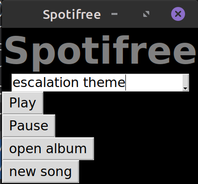
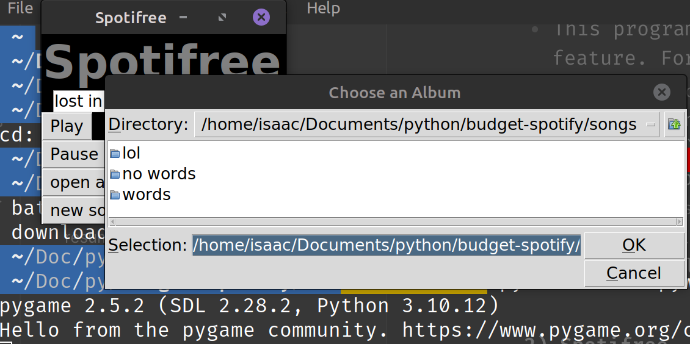

# Spotifree

> ***Video/Audio Manipulation, Web Scraping, GUI Creation*** 

 

(Examples of Spotifree/Spotifree's Album switching between "lol", "words", and "no words")
- Created to replace paid on-demand music services like <a href="https://open.spotify.com">Spotify</a>. Currently, only playlist creation/renaming/cataloguing, the ability to search for new songs, and offline listening are implemented. In the future, more features can be added to create a better alternative than market options.
- I am not a illegal pirater, roaming the free seas. I currently use Spotify Premium, and am a paying customer. [PHOTO PROOF](https://docs.google.com/document/d/1FZb_qFQmmENnErUF-tbIIstdcnCbly3Ek6cBFQO3keU/edit?usp=sharing)
- This program is cross platform, aside from the notification feature. For full functionality, Windows is preferred.
- Running `main.pyw` catalogs the current songs saved and creates a window generated with `tkinter`, Python's native GUI library. Audio pause/play functionality is done with `pygame`. Although meant for creating games, `pygame` has extremely simple audio controls.
- The search functionality pipes text input from `tkinter` into a completely downloaded song. It has three steps:
	1. Search: selects the desired song with `pytube`'s built in query feature
	2. Download/Parse: downloads the selected video stream from YouTube using `pytube` and converts that into a `pygame`-friendly audio file via `ffmpeg`, the universal CLI application for video/audio manipulation.
	3. Catalog: saves the file into the desired playlist, organized in your files as folders